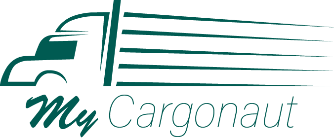

# MyCargonaut

## About this project
This project is part of the course **Konzepte moderner Softwareentwicklung** at the **THM** (University of Applied Sciences Mittelhessen).

MyCargonaut is a **webbased project** that aims to **connect drivers and passengers** and also allows to offer and search for **cargo delivery services**.

For further information please visit the [Wiki](https://git.thm.de/jcwb53/kms-cargonout/-/wikis/home) of this project.

## Shortcuts
- [Project Setup](https://git.thm.de/jcwb53/kms-cargonout/-/wikis/Project-Setup-Frontend-&-Backend)
- [Execution](https://git.thm.de/jcwb53/kms-cargonout/-/wikis/Run-the-project)
- [Contributing](https://git.thm.de/jcwb53/kms-cargonout/-/wikis/Contributing)